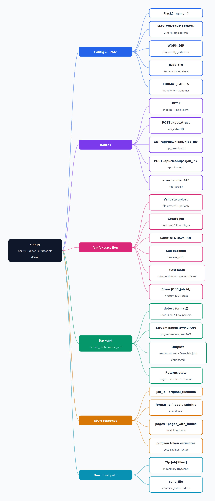

# `app.py` — Scotty Budget Extractor API

Mindmap of the Flask API that fronts the budget-extraction backend
(`extract_multi.process_pdf`). The rendered image is generated by
`docs/generate_mindmap.py`.



## Mermaid source

```mermaid
mindmap
  root)"app.py<br/>Scotty Budget Extractor API (Flask)"(
    Config & State
      Flask(__name__)
      MAX_CONTENT_LENGTH — 200 MB upload cap
      WORK_DIR — /tmp/scotty_extractor
      JOBS dict — in-memory job store
      FORMAT_LABELS — friendly format names
    Routes
      GET / → index() → index.html
      POST /api/extract → api_extract()
      GET /api/download/{job_id} → api_download()
      POST /api/cleanup/{job_id} → api_cleanup()
      errorhandler 413 → too_large()
    /api/extract flow
      Validate upload — file present, .pdf only
      Create job — uuid hex[:12] + job_dir
      Sanitise & save PDF
      Call backend — process_pdf()
      Cost math — token estimates, savings factor
      Store JOBS[job_id] → return JSON stats
    Backend — extract_multi.process_pdf
      detect_format() — USVI 3-col / 4-col parsers
      Stream pages (PyMuPDF) — page-at-a-time, low RAM
      Outputs — structured.json, financials.json, chunks.md
      Returns stats — pages, line items, format
    JSON response
      job_id, original_filename
      format_id / label / subtitle, confidence
      pages, pages_with_tables, total_line_items
      pdf/json token estimates, cost_savings_factor
    Download path
      Zip job['files'] in memory (BytesIO)
      send_file — {name}_extracted.zip
```

## Regenerate

```bash
pip install cairosvg   # only needed for the PNG
python3 docs/generate_mindmap.py
```
