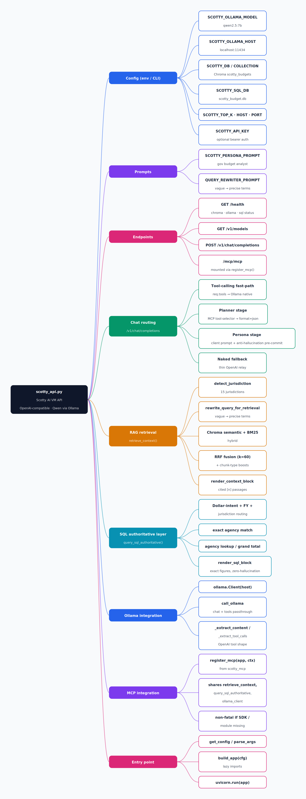

# `scotty_api.py` — Scotty AI VM API (Qwen via Ollama)

Mindmap of the FastAPI server that runs on the GPU VM and serves a local
**Qwen2.5** model (via Ollama) behind an **OpenAI-compatible**
`/v1/chat/completions` endpoint — a drop-in replacement for the Grok
backend. It adds hybrid RAG (ChromaDB + BM25) and a SQL authoritative
layer for exact figures.

Scoped to `scotty_api.py` only — the MCP *tools* are defined in
`scotty_mcp.py`, so this diagram shows just the MCP wiring (`register_mcp`)
as it appears in the API file. The rendered image is generated by
`docs/generate_mindmap.py`.



## Mermaid source

```mermaid
mindmap
  root)"scotty_api.py<br/>Scotty AI VM API — Qwen via Ollama"(
    Config (env / CLI)
      SCOTTY_OLLAMA_MODEL — qwen2.5:7b
      SCOTTY_OLLAMA_HOST — localhost:11434
      SCOTTY_DB / COLLECTION — Chroma scotty_budgets
      SCOTTY_SQL_DB — scotty_budget.db
      SCOTTY_TOP_K, HOST, PORT
      SCOTTY_API_KEY — optional bearer auth
    Prompts
      SCOTTY_PERSONA_PROMPT — gov budget analyst
      QUERY_REWRITER_PROMPT — vague to precise terms
    Endpoints
      GET /health — chroma, ollama, sql status
      GET /v1/models
      POST /v1/chat/completions
      /mcp/mcp — mounted via register_mcp()
    Chat routing (/v1/chat/completions)
      Tool-calling fast-path — req.tools to Ollama native
      Planner stage — MCP tool-selector, format=json
      Persona stage — client prompt + anti-hallucination pre-commit
      Naked fallback — thin OpenAI relay
    RAG retrieval — retrieve_context()
      detect_jurisdiction — 15 jurisdictions
      rewrite_query_for_retrieval — vague to precise terms
      Chroma semantic + BM25 — hybrid
      RRF fusion (k=60) + chunk-type boosts
      render_context_block — cited [n] passages
    SQL authoritative layer — query_sql_authoritative()
      Dollar-intent + FY + jurisdiction routing
      exact agency match
      agency lookup / grand total
      render_sql_block — exact figures, zero-hallucination
    Ollama integration
      ollama.Client(host)
      call_ollama — chat + tools passthrough
      _extract_content / _extract_tool_calls — OpenAI tool shape
    MCP integration
      register_mcp(app, ctx) — from scotty_mcp
      shares retrieve_context, query_sql_authoritative, ollama_client
      non-fatal if SDK / module missing
    Entry point
      get_config / parse_args
      build_app(cfg) — lazy imports
      uvicorn.run(app)
```

## Regenerate

```bash
pip install cairosvg   # only needed for the PNG
python3 docs/generate_mindmap.py
```
